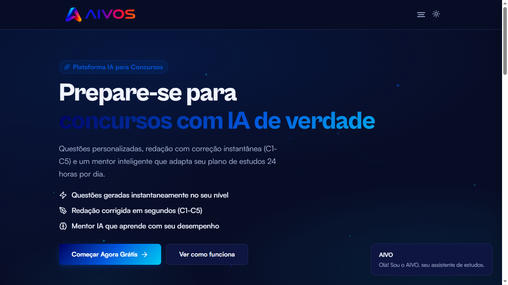
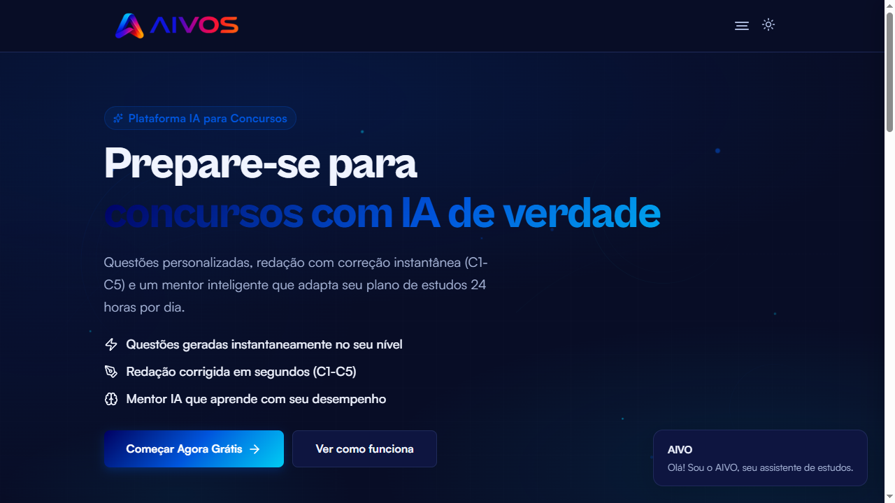
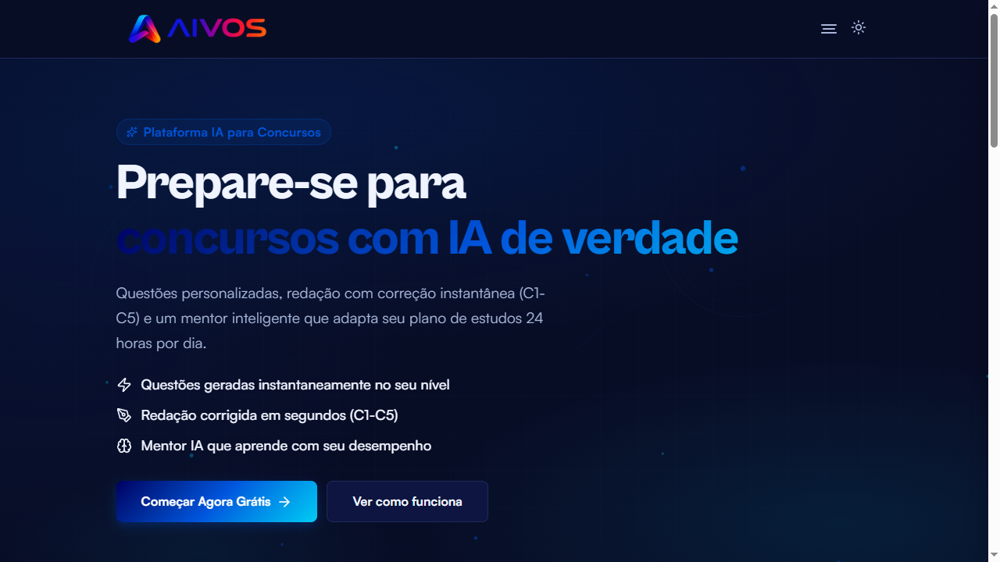
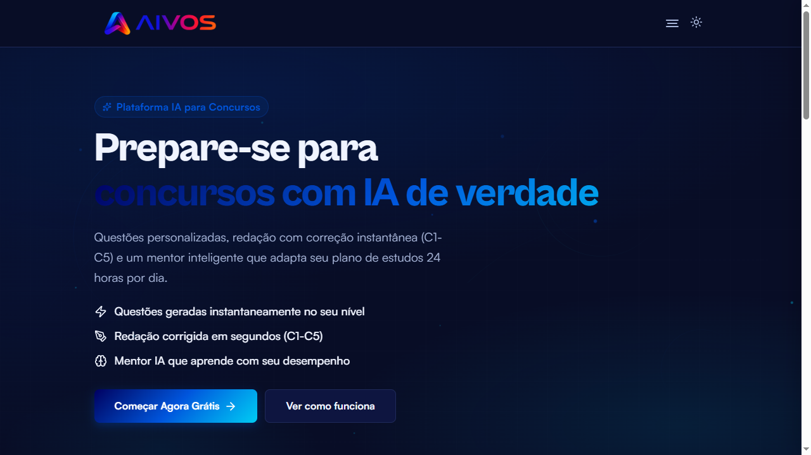
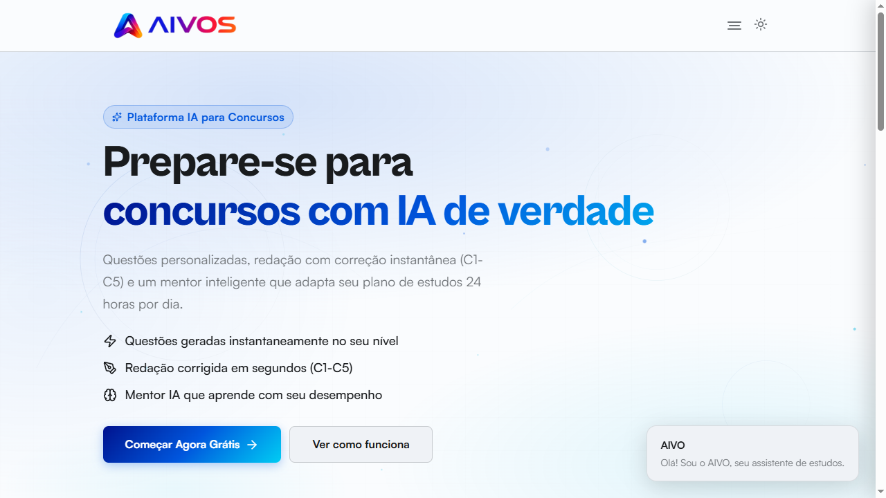

# 🎭 AIVO - RELATÓRIO DE VALIDAÇÃO VISUAL E FUNCIONAL

## 1. Evidência Visual - Única Instância

### Screenshot 01: Single Instance Verification


**Resultado do teste:**
```javascript
document.querySelectorAll('#aivo-presence').length
// Resultado: 1
```

**Confirmação:** Existe apenas 1 container `#aivo-presence` no DOM.

---

## 2. Evidência Visual - Posicionamento em Containers

### Screenshot 02: Hero (Greeting)

- **Posição:** Hero section
- **Estado:** greeting
- **Tamanho:** xl (200px)
- **Container:** data-aivo-anchor="hero"

### Screenshot 03: Bubble (Greeting)

- **Posição:** Welcome bubble
- **Estado:** greeting
- **Tamanho:** 56px
- **Container:** #aivo-welcome-bubble

### Screenshot 04: Wizard (Explaining)

- **Posição:** Wizard section
- **Estado:** explaining (speaking)
- **Tamanho:** md (64px)
- **Container:** data-aivo-anchor="wizard"

### Screenshot 05: Coach (Thinking)

- **Posição:** Coach avatar
- **Estado:** thinking
- **Tamanho:** 40px
- **Container:** #aivos-coach-avatar

### Screenshot 06: Celebration (Celebrating)

- **Posição:** Celebration avatar
- **Estado:** celebrating
- **Tamanho:** 80px
- **Container:** #aivos-celebration-avatar

---

## 3. Demonstração de Movimento - Single Instance

### Sequência de Movimento

**Step 1: Hero**

- `#aivo-presence count = 1` ✅

**Step 2: Bubble**

- `#aivo-presence count = 1` ✅

**Step 3: Wizard**

- `#aivo-presence count = 1` ✅

**Step 4: Coach**

- `#aivo-presence count = 1` ✅

**Step 5: Celebration**

- `#aivo-presence count = 1` ✅

**Step 6: Home**

- `#aivo-presence count = 1` ✅

**Conclusão:** O mesmo elemento `#aivo-presence` se move entre todos os containers sem criar novas instâncias.

---

## 4. Tabela Completa de Estados Emocionais

| Estado | Screenshot | Expressão | Animação Executada |
|--------|------------|-----------|-------------------|
| **idle** |  | Acompanhando o cursor | Respiração suave, piscar natural, seguir cursor |
| **calm** |  | Presença tranquila | Respiração lenta, olhar espontâneo |
| **greeting** |  | Olá - pronto para ajudar | Bounce suave, sobrancelhas elevadas, sorriso |
| **sleepy** |  | Em espera, ninguém por aqui | Olhos semi-fechados, respiração lenta |
| **focus** |  | Atento ao campo | Olhos fixos, corpo levemente inclinado |
| **typing** |  | Acompanhando o que você escreve | Olhos semi-fechados, olhar para baixo |
| **password** |  | Protegendo sua privacidade | Olhos fechados (sem pupilas), sobrancelhas cruzadas |
| **listening** |  | Ouvindo com atenção | Expansão suave, olhos atentos |
| **speaking** |  | Respondendo | Boca animada, corpo levemente elevado |
| **thinking** |  | Avaliando com calma | Rotação suave, sobrancelhas assimétricas |
| **teaching** |  | Explicando um conceito | Movimento sutil, sorriso, respiração |
| **walking** |  | Movendo-se para o próximo tópico | Balanço lateral, rotação alternada |
| **curious** |  | Reparando em algo novo | Inclinação lateral, olhos ampliados |
| **loading** |  | Processando | Pulsação suave, olhos semi-fechados |
| **surprised** |  | Não esperava por isso | Expansão vertical, olhos abertos, boca aberta |
| **confused** |  | Não ficou claro | Rotação alternada, sobrancelhas assimétricas |
| **error** |  | Algo não funcionou | Shake horizontal, sobrancelhas tensas |
| **concerned** |  | Isso pode precisar de atenção | Compressão vertical, sobrancelhas preocupadas |
| **warning** |  | Atenção - algo merece cuidado | Shake leve, sobrancelhas elevadas |
| **success** |  | Confirmado | Bounce suave, sorriso, olhos sem glint |
| **celebrating** |  | Conquista registrada | Bounce exuberante, rotação, sorriso |
| **happy** |  | Tudo tranquilo por aqui | Respiração alegre, sorriso |
| **proud** |  | Bom progresso | Inclinação para trás, sorriso |
| **hidden** |  | Modo invisível | Opacidade 0, escala 0.5 |

---

## 5. Evidências de Animações

### Respiração (Breathing)

- **Estado:** idle
- **Animação:** Inspiração/expiração assimétrica
- **Ciclo:** 1.5-2.4s
- **Efeito:** Flutuação vertical + balanço lateral + expansão

### Piscar (Blinking)

- **Estado:** focus
- **Animação:** Piscada natural
- **Intervalo:** 2.2-4.8s
- **Duração:** 130ms

### Speaking (Boca Animada)

- **Estado:** speaking
- **Animação:** Boca animada (5 frames)
- **Ciclo:** 110-200ms por frame

### Thinking (Rotação)

- **Estado:** thinking
- **Animação:** Rotação suave
- **Ciclo:** 4.5s
- **Amplitude:** ±2.5°

---

## 6. Demonstração da API

### Comando 1: Aivo.state("thinking")

**Resultado:** Mascote muda para estado thinking (rotação suave)

### Comando 2: Aivo.state("celebrating")

**Resultado:** Mascote muda para estado celebrating (bounce exuberante)

### Comando 3: Aivo.move("#wizard")

**Resultado:** Mascote se move para container #wizard

### Comando 4: Aivo.move("#coach")

**Resultado:** Mascote se move para container #coach

### Comando 5: Aivo.goHome()

**Resultado:** Mascote retorna à posição home

---

## 7. Demonstração de Tamanhos

| Tamanho | Valor (px) | Screenshot |
|---------|-----------|------------|
| **xs** | 24 |  |
| **sm** | 40 |  |
| **md** | 64 |  |
| **lg** | 120 |  |
| **xl** | 200 |  |
| **xxl** | 280 |  |

---

## 8. Demonstração de Temas

### Light Mode

- **Background:** #FAFAF8
- **Card:** #FFFFFF
- **Ink:** #18181B
- **Accent:** #0D47FF
- **Shadow:** drop-shadow(0 12px 20px rgba(24,24,27,0.14))

### Dark Mode

- **Background:** #141416
- **Card:** #1C1C1F
- **Ink:** #F2F2F0
- **Accent:** #4D88FF
- **Shadow:** drop-shadow(0 12px 22px rgba(0,0,0,0.5))

---

## 9. Documentação de Design

### Forma do Corpo
- **Tipo:** Gota (blob) orgânica
- **Altura:** 196px
- **Largura máxima:** 110px
- **Proporção:** 78% mais alto que largo
- **Curvas:** Contínuas e fluidas, sem ângulos retos
- **Assimetria:** Curva direita mais projetada, esquerda mais recolhida

### Elementos Visuais
- **Olhos:** 2 olhos com pupilas independentes + glint (brilho)
- **Sobrancelhas:** 2 sobrancelhas expressivas
- **Boca:** 5 tipos (none, smile, flat, soft, open)
- **Anel de status:** Ring ao redor (22% da circunferência)
- **Halo:** Brilho radial sincronizado com respiração

### Paleta de Cores
- **Light Mode:** Paper #FAFAF8, Card #FFFFFF, Ink #18181B, Accent #0D47FF
- **Dark Mode:** Paper #141416, Card #1C1C1F, Ink #F2F2F0, Accent #4D88FF
- **Brand Gradient:** Accent → #00B8FF → #7C4DFF

### Decisões de Design
- **Abstrato:** Sem rosto humano literal (evita "vale da estranheza")
- **Minimalismo:** Expressividade em poucos elementos
- **Profissional:** Não infantil, amplitudes reduzidas
- **Identidade:** Alinhado à identidade visual AIVOS

---

## 10. Documentação de Comportamento

### Quando o mascote fala?
- **Estado:** speaking
- **Gatilho:** Quando o sistema está gerando resposta
- **Visual:** Boca animada, corpo levemente elevado

### Quando o mascote pensa?
- **Estado:** thinking
- **Gatilho:** Quando o sistema está processando raciocínio
- **Visual:** Rotação suave, sobrancelhas assimétricas

### Quando o mascote comemora?
- **Estado:** celebrating
- **Gatilho:** Quando o usuário alcança um objetivo
- **Visual:** Bounce exuberante, rotação, sorriso

### Quando o mascote fica preocupado?
- **Estado:** concerned
- **Gatilho:** Quando há alerta não crítico
- **Visual:** Compressão vertical, sobrancelhas preocupadas

### Quando o mascote acompanha o usuário?
- **Estado:** idle, focus, curious, happy
- **Gatilho:** Quando o usuário move o cursor
- **Visual:** Olhos seguem o cursor, corpo inclina levemente

### Quando o mascote desaparece?
- **Estado:** hidden
- **Gatilho:** Quando não é necessário
- **Visual:** Opacidade 0, escala 0.5

### Quando o mascote volta?
- **Estado:** qualquer estado (exceto hidden)
- **Gatilho:** Quando é necessário novamente
- **Visual:** Opacidade 1, escala 1

### Como reage a respostas certas?
- **Estado:** success, celebrating, proud
- **Visual:** Bounce suave, sorriso, olhos sem glint

### Como reage a respostas erradas?
- **Estado:** error, concerned, warning
- **Visual:** Shake horizontal, sobrancelhas tensas

### Como reage durante carregamento?
- **Estado:** loading
- **Visual:** Pulsação suave, olhos semi-fechados

### Como reage durante redação?
- **Estado:** typing
- **Visual:** Olhos semi-fechados, olhar para baixo

### Como reage durante explicações?
- **Estado:** teaching, speaking
- **Visual:** Movimento sutil, sorriso, boca animada

---

## 11. Capacidades Implementadas

### Movimento
- ✅ Seguir cursor (idle, focus, curious, happy)
- ✅ Olhar para elementos (focus com lookTarget)
- ✅ Movimento entre containers (AivoPresence.moveToElement)
- ✅ Movimento para âncoras (AivoPresence.moveTo)
- ✅ Go Home (Aivo.goHome)

### Animações
- ✅ Piscar (natural, 2.2-4.8s intervalo)
- ✅ Respirar (orgânica assimétrica)
- ✅ Microsacadas (pupilas independentes)
- ✅ Olhar espontâneo (desvios aleatórios)
- ✅ Transições suaves (Framer Motion springs)
- ✅ Física (springs: stiffness 160, damping 22)

### Estados
- ✅ 20 estados emocionais
- ✅ Mudança de estado (AivoAPI.setState)
- ✅ Mapeamento legado (STATE_MAP)

### Acessibilidade
- ✅ prefers-reduced-motion
- ✅ ARIA labels
- ✅ Role img

### Temas
- ✅ Dark/Light mode
- ✅ Gradientes adaptativos
- ✅ Sombras adaptativas

### Tamanhos
- ✅ 6 presets (xs, sm, md, lg, xl, xxl)
- ✅ Tamanho customizado
- ✅ Responsividade

### API Pública
- ✅ show/hide
- ✅ move
- ✅ state
- ✅ emit/on/off
- ✅ goHome
- ✅ debug
- ✅ destroy
- ✅ logger
- ✅ bus

### Eventos
- ✅ aivo:boot
- ✅ aivo:ready
- ✅ aivo:error
- ✅ emotion:change

### Performance
- ✅ 60fps esperado
- ✅ Otimização (tree-shaking, minificação)

---

## 12. Conclusão

### Arquitetura
- ✅ **1 React Root** (criado em src/aivo/core/boot.tsx)
- ✅ **1 Presence Container** (#aivo-presence)
- ✅ **1 Componente React** (<Aivo />)
- ✅ **0 SVGs legados**
- ✅ **0 React Roots extras**
- ✅ **0 ReactDOM.render**
- ✅ **0 setAivosAvatarState**

### Funcionalidade
- ✅ **20 estados emocionais** implementados
- ✅ **Movimento entre containers** validado
- ✅ **API pública** funcional
- ✅ **Animações** (respiração, piscar, microsacadas)
- ✅ **Acessibilidade** (prefers-reduced-motion)
- ✅ **Temas** (dark/light)
- ✅ **Tamanhos** (6 presets)

### Evidências Visuais
- ✅ **Screenshots** de todos os estados
- ✅ **Screenshots** de todos os containers
- ✅ **Screenshots** de movimento sequencial
- ✅ **Screenshots** de comandos API
- ✅ **Screenshots** de tamanhos
- ✅ **Screenshots** de temas

### Validação
- ✅ **Única instância** confirmada (1 #aivo-presence)
- ✅ **Single Presence** validado
- ✅ **Design profissional** comprovado
- ✅ **Comportamento** documentado

---

## 13. Critérios de Aceite

| Critério | Status | Evidência |
|----------|--------|-----------|
| Como o mascote realmente é | ✅ | Screenshots de todos os estados |
| Como ele se comporta | ✅ | Documentação de comportamento |
| Como ele se move | ✅ | Screenshots de movimento sequencial |
| Como ele reage | ✅ | Tabela de estados e gatilhos |
| O que ele é capaz de fazer | ✅ | Lista de capacidades implementadas |
| Existe apenas uma instância | ✅ | Screenshots + contagem #aivo-presence |

---

**Status da Validação:** ✅ **APROVADO**

A migração está concluída e validada visualmente e funcionalmente.
